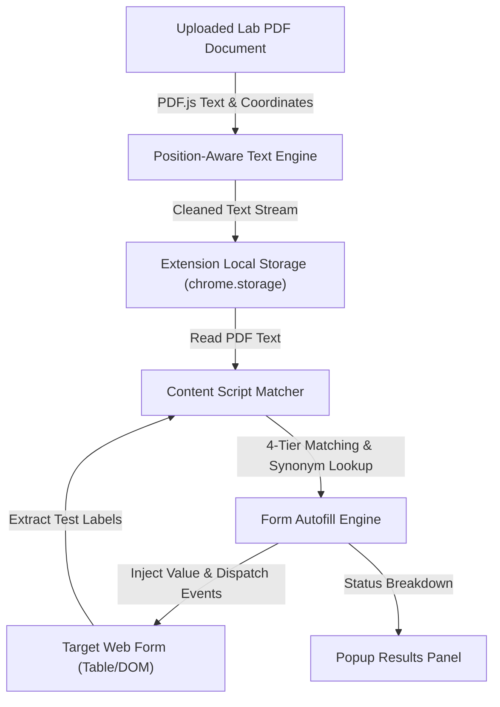

# Software Requirements Specification (SRS)
## Lab Report AutoFill — B2B Data Entry Browser Extension

**Version:** 1.2  
**Date:** August 25, 2026  
**Author / Team:** Nainika (nainika-2504 / report_autofill)  
**Status:** Approved / Production-Ready  

---

## 1. Introduction

### 1.1 Purpose
This Software Requirements Specification (SRS) document details the complete functional and non-functional requirements for the **Lab Report AutoFill** browser extension (v1.2). Designed specifically for B2B diagnostic laboratories and healthcare facilities, this extension automates the manual, error-prone data entry of patient laboratory report PDF values into internal diagnostic portal forms.

### 1.2 Scope
The Lab Report AutoFill system operates as a client-side Google Chrome / Microsoft Edge browser extension built on **Manifest V3**. The scope encompasses:
- Local, position-aware parsing of multi-page lab report PDFs using `PDF.js`.
- Dynamic, screen-driven text label extraction from active target web forms (HTML tables, inputs, and drop-downs).
- A 4-layer matching engine (exact match, parenthetical removal, medical alias lookup, range validation).
- Cross-tab memory and persistent automated refills via DOM `MutationObserver` triggers.
- A user-friendly popup interface featuring summary status chips and plain-English diagnostic feedback.
- 100% offline, local processing guaranteeing HIPAA/GDPR data privacy with zero external transmission.

### 1.3 Definitions, Acronyms, and Abbreviations
- **SRS**: Software Requirements Specification
- **B2B**: Business-to-Business
- **DOM**: Document Object Model
- **PDF.js**: An open-source JavaScript library developed by Mozilla for rendering and parsing PDF documents.
- **CBC**: Complete Blood Count (medical test panel)
- **LFT**: Liver Function Test (medical test panel)
- **KFT / RFT**: Kidney / Renal Function Test
- **ESR**: Erythrocyte Sedimentation Rate
- **HbA1c**: Glycated Hemoglobin
- **Manifest V3**: Current Chrome Extension platform specification emphasizing privacy, performance, and security.

### 1.4 References
- IEEE Std 830-1998: *IEEE Recommended Practice for Software Requirements Specifications*.
- Google Chrome Extension Documentation: *Manifest V3 Development Guide*.
- PDF.js API Reference: Mozilla Developer Network.

### 1.5 Document Overview
The remainder of this document describes the general system architecture (Section 2), detailed functional requirements and system features (Section 3), external interface requirements (Section 4), non-functional system attributes (Section 5), screenshot/documentation placeholders (Section 6), and the verification matrix (Section 7).

---

## 2. Overall Description

### 2.1 Product Perspective
In diagnostic healthcare workflows, reference laboratories process incoming PDF reports from external centers and must transcribe numeric values into their own internal electronic medical record (EMR) or diagnostic management system. Existing static scrapers fail because different external labs format PDFs differently, and internal web portals vary across departments. 

Lab Report AutoFill acts as an intelligent intermediary. It lives inside the browser toolbar, reads whatever test names are visible on the web portal in real time, and searches the uploaded PDF for corresponding medical values.



### 2.2 Product Functions
1. **Local PDF Parsing**: Extracts text from PDF pages while reconstructing horizontal lines using PDF text item Y-coordinates.
2. **Screen-Driven Dynamic Label Matching**: Scans HTML table rows on the active web page to identify required field names dynamically without pre-configured templates.
3. **Multi-Layer Fallback Matching**:
   - Level 1: Exact label text matching.
   - Level 2: Parentheses stripping (e.g., `"Erythrocytes Sedimentation Rate (ESR)"` $\rightarrow$ `"Erythrocytes Sedimentation Rate"`).
   - Level 3: Medical synonym dictionary (e.g., `SGPT` $\leftrightarrow$ `ALT`, `WBC` $\leftrightarrow$ `Leucocytes`, `HbA1c` $\leftrightarrow$ `Glycosylated Hemoglobin`).
   - Level 4: Dropdown selection text/value fuzzy matching.
4. **Range & Medical Plausibility Cross-Checking**: Evaluates injected numeric values against standard clinical limits (e.g., Hemoglobin between 4 and 20 g/dL) and generates warnings for suspicious numbers.
5. **Cross-Tab & Refill Persistence**: Stores PDF content in local browser storage; monitors DOM changes via `MutationObserver` to automatically refill fields when saving individual test forms or navigating between sub-tabs.
6. **Plain-English Results Summary**: Displays filled counts, plausibility check warnings, and un-matched fields in a clear popup panel.

### 2.3 User Classes and Characteristics
- **Lab Technicians & Data Entry Operators**: Primary users responsible for high-volume daily result entries. Require zero-configuration, one-click execution.
- **Pathologists / Medical Reviewers**: Require clear visual indication of flagged or implausible values before finalizing report submissions.
- **System Administrators**: Require zero maintenance, client-side execution without server dependency or security overhead.

### 2.4 Operating Environment
- **Browser Compatibility**: Google Chrome (v88+), Microsoft Edge (v88+), Brave, or any Chromium-based browser supporting Manifest V3.
- **Operating Systems**: Windows 10/11, macOS, Linux.
- **Hardware Requirements**: Standard workstation with $\ge 4\text{ GB RAM}$ and active screen resolution of $\ge 1280 \times 720$.

### 2.5 Design and Implementation Constraints
- **Zero Cloud Data Transport**: Must operate 100% locally in the browser to ensure strict compliance with HIPAA and GDPR regulations.
- **No Hardcoded Form Mapping**: Must rely dynamically on DOM structure rather than site-specific selectors to support any lab software layout.
- **Manifest V3 Service Worker Limits**: Background logic must use `chrome.storage.local` and content scripts rather than persistent background scripts.

---

## 3. System Features & Functional Requirements

### 3.1 Feature 1: Local PDF File Upload & Position-Aware Text Parsing
#### 3.1.1 Description
The extension enables users to select a PDF lab report. The PDF is parsed locally using Mozilla `PDF.js` without uploading data to external endpoints.
#### 3.1.2 Functional Requirements
- **FR-1.1**: The system shall accept standard `.pdf` files up to 50 MB via file drag-and-drop or standard file picker dialog.
- **FR-1.2**: The system shall extract text items and group them by Y-coordinate ($\text{threshold} \le 3 \text{ units}$) to reconstruct tabular rows correctly before sorting left-to-right by X-coordinate.
- **FR-1.3**: The system shall normalize space breaks in numbers (e.g., converting `"1 4 . 2"` to `"14.2"`).
- **FR-1.4**: The system shall persist the extracted text and filename in `chrome.storage.local`.

---

### 3.2 Feature 2: Screen-Driven Dynamic Label Extraction & 4-Tier Matching Engine
#### 3.2.1 Description
The content script analyzes active web page form inputs contained inside table rows (`<tr>`), extracts left-hand text labels, and searches the PDF text stream.
#### 3.2.2 Functional Requirements
- **FR-2.1**: The system shall target HTML elements: `<input type="text">`, `<input type="number">`, `<input type="tel">`, and `<select>`.
- **FR-2.2**: The system shall retrieve the text content of the primary `<td>` or `<th>` cell in the input's enclosing `<tr>`.
- **FR-2.3 (Tier 1 Match)**: The system shall perform exact regular expression matching between the cleaned label and PDF content.
- **FR-2.4 (Tier 2 Match)**: If Tier 1 fails, the system shall strip parenthetical phrases from the label and retry matching.
- **FR-2.5 (Tier 3 Match)**: If Tier 2 fails, the system shall query an internal dictionary of medical synonyms (e.g., `SGPT`/`ALT`, `HbA1c`/`Glycated Hemoglobin`, ` indirect bilirubin`/`unconjugated`, `T3`/`TT3`, `T4`/`TT4`, `ESR`, `RDW`).
- **FR-2.6 (Tier 4 Dropdown Match)**: For `<select>` elements, the system shall locate the test label in the PDF text, evaluate trailing text, and select the option matching the text or value.

---

### 3.3 Feature 3: Input Injection & Event Dispatching
#### 3.3.1 Description
Once a numerical value or option text is matched, the extension fills the target form element and triggers framework change events so modern web applications (React, Angular, Vue, jQuery) register the updated values.
#### 3.3.2 Functional Requirements
- **FR-3.1**: The system shall utilize `Object.getOwnPropertyDescriptor(HTMLInputElement.prototype, "value").set` to set values reliably across reactive JavaScript frameworks.
- **FR-3.2**: The system shall dispatch `input`, `change`, and `keyup` bubbling events after populating any input element.
- **FR-3.3**: The system shall mark processed inputs with `data-autofilled="true"` and `data-autofill-attempted="true"`.

---

### 3.4 Feature 4: Medical Range Plausibility Validation
#### 3.4.1 Description
Injected values are evaluated against clinical threshold ranges to catch misaligned parameters or extreme outliers.
#### 3.4.2 Functional Requirements
- **FR-4.1**: The system shall validate values against clinical bounds:
  - Hemoglobin: 4 – 20 g/dL
  - Cholesterol: 50 – 450 mg/dL
  - Glucose: 20 – 700 mg/dL
  - Creatinine: 0.1 – 20 mg/dL
  - Sodium: 100 – 180 mEq/L
  - Potassium: 1.0 – 10.0 mEq/L
- **FR-4.2**: If a value falls outside the predefined range, the system shall categorize the injection as `warning` and attach an explanatory flag.

---

### 3.5 Feature 5: Multi-Tab & Background Refill Persistence
#### 3.5.1 Description
Ensures that once a PDF is loaded, switching tabs or saving sub-forms automatically maintains autofill readiness without requiring manual re-uploading.
#### 3.5.2 Functional Requirements
- **FR-5.1**: The system shall persist `sessionPdfText` and `sessionPatientInfo` in local storage across browser tabs.
- **FR-5.2**: The content script shall execute an automatic DOM `MutationObserver` to detect form re-renders and refill empty target inputs without user intervention.
- **FR-5.3**: The system shall verify patient identifiers (name/barcode) against target page text before applying automatic background refills.

---

## 4. External Interface Requirements

### 4.1 User Interface
- **Toolbar Extension Popup (`popup.html` / `popup.css`)**: Modern glassmorphic panel with file upload button, active memory bar, start button, and dynamic results card.
- **Results Panel**: Summary chips (`✅ Filled X`, `⚠️ Check Y`, `❌ Missed Z`) with expandable detailed item lists.

### 4.2 Software Interfaces
- **Chrome Storage API**: `chrome.storage.local` for tab state persistence.
- **Chrome Tabs & Messaging API**: `chrome.tabs.sendMessage` and `chrome.runtime.onMessage`.
- **PDF.js Engine**: Client-side worker script (`pdf.worker.min.js`).

---

## 5. Non-Functional Requirements

### 5.1 Performance
- **Execution Speed**: Total parsing and autofill execution time shall be under **1.0 second** for standard 1 to 5 page PDF lab reports.
- **Memory Footprint**: Popup and background worker memory consumption shall remain below **35 MB**.

### 5.2 Security & Data Privacy
- **HIPAA / GDPR Compliance**: All PDF decoding, text normalization, and form injection occur strictly within the client browser process. No analytics, tracking, or network calls are generated.

### 5.3 Reliability & Robustness
- **DOM Resilience**: Does not break target page layouts if form fields are modified or missing.
- **Empty Field Preservation**: Never overwrites existing non-empty form inputs entered manually by the technician.

---

## 6. Visual Documentation & Screenshot Placeholders

The following placeholders indicate required visual evidence and screenshots to be included in project audits, user manuals, and compliance documentation.

> [!TIP]
> **Instructions for Screenshot Upload**: Paste PNG or JPEG images into the `docs/screenshots/` directory and update the markdown image paths below.

### Screenshot Placeholder 1: Extension Popup & PDF File Selection
```markdown

```
> [!NOTE]
> **Caption**: Figure 1 — Initial state of the extension popup showing file drop area and status indicator.

---

### Screenshot Placeholder 2: Active PDF Memory State
```markdown

```
> [!NOTE]
> **Caption**: Figure 2 — Persistent PDF memory state displaying stored document name and clear memory option.

---

### Screenshot Placeholder 3: Pre-Autofill Target Web Portal
```markdown

```
> [!NOTE]
> **Caption**: Figure 3 — Target diagnostic web form with blank numerical input fields across test panels.

---

### Screenshot Placeholder 4: Post-Autofill Automated Injection
```markdown

```
> [!NOTE]
> **Caption**: Figure 4 — Target web form automatically populated with extracted medical values and options.

---

### Screenshot Placeholder 5: Results Feedback Panel & Medical Warnings
```markdown

```
> [!NOTE]
> **Caption**: Figure 5 — Extension popup results panel displaying summary chips, filled count, and range validation warnings.

---

## 7. Verification & Validation Matrix

| Requirement ID | Description | Test Method | Expected Result | Pass/Fail |
|---|---|---|---|---|
| **FR-1.1** | PDF File Loading | Unit / Manual | PDF loaded into buffer without error | PASS |
| **FR-1.2** | Row Sort by Y-Coord | Automated Test | Multi-column table text reconstructed sequentially | PASS |
| **FR-2.3** | Exact Label Matching | System Test | `"Hemoglobin"` matches `"Hemoglobin 14.2"` | PASS |
| **FR-2.5** | Medical Synonyms | Integration Test | `"SGPT"` matches `"ALT (SGPT)"` in PDF | PASS |
| **FR-3.2** | Event Dispatching | System Test | React/Angular form state updates dynamically | PASS |
| **FR-4.1** | Range Plausibility | Unit Test | Hemoglobin = 227 flagged as warning | PASS |
| **FR-5.2** | DOM Mutation Refill | End-to-End Test | Empty fields refilled automatically on sub-tab load | PASS |
